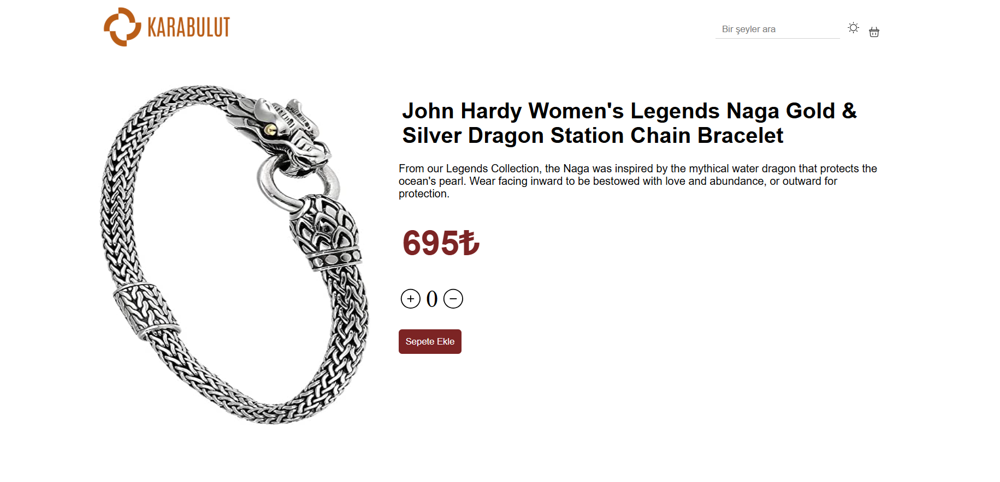

# 🛒 React E-Commerce App

Bu proje, React kullanılarak geliştirilmiş bir e-ticaret uygulamasıdır. Ürün verileri [Fake Store API](https://fakestoreapi.com/) kullanılarak alınmıştır. Uygulama, modern bir e-ticaret deneyimi sunmak için kullanıcı dostu bir tasarım ve işlevsellik ile hazırlanmıştır.

## 🚀 Özellikler

- 🔍 Ürünleri görüntüleme ve detay sayfasına erişim
- 🛒 Ürünleri sepete ekleme ve çıkarma
- 💳 Toplam tutarı hesaplama
- 📱 Tamamen duyarlı (responsive) tasarım
- 🌐 API entegrasyonu ile gerçek zamanlı veri çekimi

## 🛠️ Kullanılan Teknolojiler

- **React**: Kullanıcı arayüzünü oluşturmak için kullanıldı.
- **React Router**: Sayfa yönlendirmeleri için.
- **Redux Toolkit**: Uygulamanın durum yönetimi için kullanıldı.
- **Axios**: API ile veri alışverişi yapmak için.

## 📸 Ekran Görüntüleri

## 📦 Projeyi Çalıştırma

Projeyi kendi bilgisayarınızda çalıştırmak için aşağıdaki adımları izleyebilirsiniz:

1. E-COMMERCE dosyasını zipten çıkarın.
2. Terminal veya komut satırında, proje klasörüne gidin ve bağımlılıkları yüklemek için npm install komutunu çalıştırın.
3. Projeyi yerel sunucuda görüntülemek için npm run dev komutunu çalıştırın.
   
